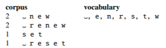

# 2.3 Unicode
how to encode all the characters in machine-readable way
individual character level tokenization

ASCII: English-specific subset of Unicode

More than 150,000 characters and 168 different scripts supported in Unicode 16.0.

## 2.3.1 Code Points

Unicode assigns a unique id(code point) for each one of these 150,000 characters.

Unicode contains ASCII at first 127 code.

not glyph(stored in fonts)

## 2.3.2 UTF-8 Encoding

represent a character in a text string

UTF-32: 4bytes/32bits to represent 1.1 million characters; too long

***UTF-8** (Unicode Transformation Format 8): the most common method; **variable-length encoding.**