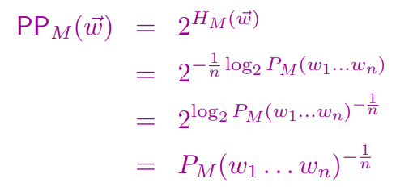
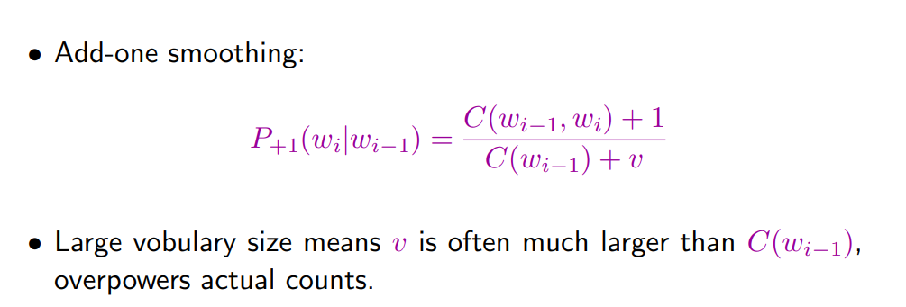
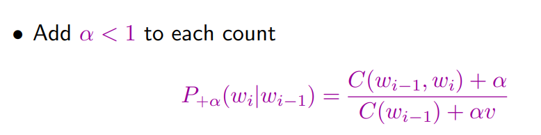
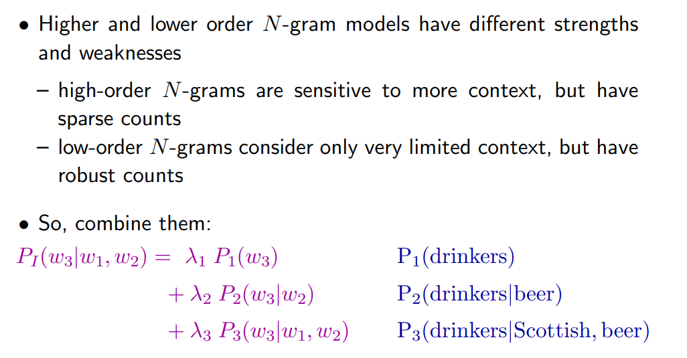
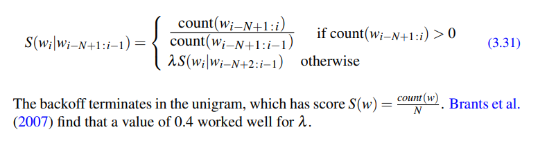
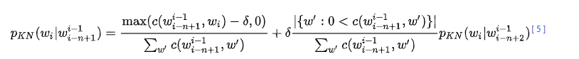
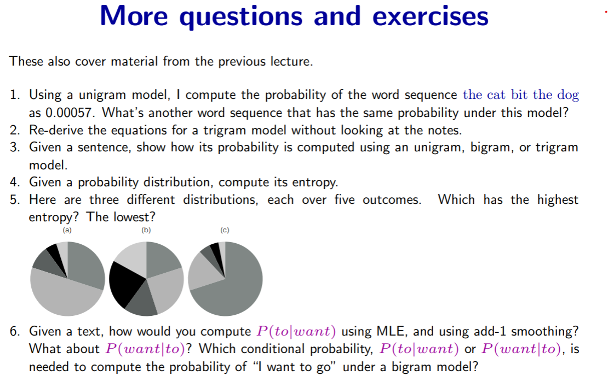

---
jupyter:
  jupytext:
    text_representation:
      extension: .md
      format_name: markdown
      format_version: '1.3'
      jupytext_version: 1.17.2
  kernelspec:
    display_name: Python 3 (ipykernel)
    language: python
    name: python3
---

- MLE
Relative frequency estimation = maximum-likelihood estimation

    $\hat{\theta} = \arg\max_{\theta} P(D|\theta)$

    $P_(ML) (x) = C(x) / N$
- Normal Distribution:

    $p(x | μ, σ) = (1 / (σ√(2π))) * exp( -(x - μ)^2 / (2σ^2) )$


## Slides w0201
- What do we mean by the “probability of a sentence” and what is it good for?
  
    - “Probability of a sentence” = how likely is it to occur in natural language;
    - useful for language engineering;correcting grammar o, spelling errors,speech system,augmentative and alternative communication(AAC)
    - useful in linguistic science;
    - Events that have never occurred!=probabilities zero
    - 
- What is probability estimation? What does it require?

    - data: measurements of relevant info
    - model: equations/procedures to estimate the probability using the data.

- What is a generative model and what are model parameters?

    - a probabilistic process that describes how the data were generated.
    - Structure (or form) of the model: the form of the equations, usually determined by knowledge about the problem
    - Parameters of the model: specific values in the equations that are usually determined using the training data.

- What is maximum-likelihood estimation and how do I compute?
    - The likelihood is the probability of the observed data d undersome particular model with parameters θ: that is, P(d|θ).
    - choose θ using relative frequencies, get the maximum possible value for P(d|θ)


# 


# 3: N-gram Language Model


### 1. Motivation: 

- sentence **sparse** problem
- unigram==bags-of-words: aboutness/relevance. NO context
- bigran/trigram: Markov assumption, only a finite history matters. 


### 2. Estimation:

- MLE  
$P(w) = P(w1, w2, ..., wn)
       = Π_{i=1}^n P(wi | w1, ..., wi-1)
$

- Markov Assumption  
$P(w) = Π_{i=1}^n P(wi | w_(i-N+1:i-1))
$

``` Example:
P(<s> i want english food </s>)  
= P(i|<s>)P(want|i)P(english|want)P(food|english)P(</s>|food)
= 0.25×0.33×0.0011×0.5×0.68
= 0.000031
```
- Dealing with scale in large n-gram models: Log probabilities
  p1 × p2 × p3 × p4 = exp(log p1 +log p2 +log p3 +log p4)


### 3. Evaluation:

- **Entropy**: a measure of uncertainty/disorder, how many yes-no questions do we need to find out the outcome?  certainty-->1
$H(X) = - Σ_x P(x) log_2 P(x)$

- **Cross entropy**: measures how well model M predicts the data.  
$H_m(w1...wn) = - 1/n*log_2 P_m(w1...wn)$

- **Perplexity**: And the higher the probability, the lower the perplexity; Maximizing probability equals to minimize perplexity


- Still, when possible a model’s improvement in perplexity should be confirmed by an end-to-end
evaluation on a real task.


### 4. problem with MLE: overfitting/zero probs


# 3.6 Smoothing, Interpolation, and Backoff
Smoothing methods, which reassign probability mass from observed to unobserved events, to avoid overfitting and zero probs.
- Uniform probabilities (add-α, Good-Turing)
- Probabilities from lower-order n-grams (interpolation, backoff)
- Probability of appearing in new contexts (Kneser-Ney)


## 1. add-one smoothing/laplace



**problem**: Add-one smoothing steals way too much


## 2. Add-alpha smoothing


  
Add-k smoothing requires that we have a method for choosing k; this can be done, for example, by optimizing on a devset.
Some cleverer methods such as **Good-Turing** improve on this by
discounting less from very frequent items.

***[Good-Turing]** smoothing redistributes probability mass from low-frequency events to unseen events so that even unobserved outcomes get a nonzero probability.*

**problem**:  assign equal probability to all unseen events.


## 3. Interpolation and Backoff


  
hyperparameter are optimized on held-out(dev) data set and sum to 1
## Backoff
if the n-gram we need has zero counts, we approximate it by backing off to the (n-1)-gram  



## 4. Kneser-Ney


Idea: probability of seeing a word in a new context is higher if
we’ve seen that word in many distinct contexts; lower otherwise.



# Remianing Issues: 
Word similarity & long-distance dependency


# N-grams as generative AI
We generate sentences by **sampling** from the model  
MLE: choose the highest probability: determinism>diversity  
Orginal sampling: determinism<diversity
### Advanced sampling
##### trade-off in **quality** and **diversity**
1. top-k
2. top-p
3. temperature
$$
P_{\tau}(x_i) \;=\; 
\frac{P(x_i)^{\tfrac{1}{\tau}}}
{\sum_{j=1}^n P(x_j)^{\tfrac{1}{\tau}}}
$$

$\tau>1$: smoother,diversity  
$\tau<1$: sharp,determinism


# W02L03 exercise


  


## 1. Same probability under a unigram model

* In a unigram model:
$$
  P(w_1\ldots w_n) = \prod_a{i=1}^n P(w_i)
$$
* This is the bags-of-words, so the order does't matter.
* Sequence contains these words (e.g., `the dog bit the cat`) has the same probability.
* the number of sentences with same probability would be 5!/2!.

## 2. Trigram model equations

* **Chain rule**:
$$
  P(w_1\ldots w_n) = \prod_{i=1}^n P(w_i \mid w_1\ldots w_{i-1})
$$
* **Markov assumption**: finite history matters
$$
  P(w_i \mid w_1\ldots w_{i-1}) \approx P(w_i \mid w_{i-2}, w_{i-1})
$$
* **Model**:
$$
  P(w_1\ldots w_n) \approx P(w_1) P(w_2 \mid w_1) \prod_{i=3}^n P(w_i \mid w_{i-2}, w_{i-1})
$$
* **MLE estimation**:
$$
  \hat P(w_i \mid w_{i-2}, w_{i-1}) = \frac{\text{count}(w_{i-2}, w_{i-1}, w_i)}{\text{count}(w_{i-2}, w_{i-1})}
$$


<!-- #region -->
## 3. Sentence probability under different models

* **Unigram**:
$$
  P_{\text{uni}}(w_1\ldots w_n) = \prod_{i=1}^n P(w_i),\quad P(w) = \frac{\text{count}(w)}{N}
$$
* **Bigram**:
$$
  P_{\text{bi}}(w_1\ldots w_n) = P(w_1) \prod_{i=2}^n P(w_i \mid w_{i-1})
$$
* **Trigram**:
$$
  P_{\text{tri}}(w_1\ldots w_n) = P(w_1) P(w_2 \mid w_1) \prod_{i=3}^n P(w_i \mid w_{i-2}, w_{i-1})
$$


## 4. Entropy of a distribution
$$
  H(X) = -\sum_i p(x_i) \log_2 p(x_i)
$$
If using cross-entropy to compute sentence(which I think is simplified?):    
$$H(w_1w_2...w_n) = -1/n\log_2 P(w_1w_2...w_n)$$
## 5. Comparing three distributions

I think (b) should have **highest** entropy, because any non-uniform distribution has lower entropy
than the corresponding uniform distribution. (c) has lowest entropy. 

## 6. Conditional probabilities with MLE and smoothing

* **MLE estimate**:
$$
  P_{\text{MLE}}(\text{to} \mid \text{want}) = \frac{\text{count}(\text{want, to})}{\text{count}(\text{want})}
$$
$$
  P_{\text{MLE}}(\text{want} \mid \text{to}) = \frac{\text{count}(\text{to, want})}{\text{count}(\text{to})}
$$
* **Add-1 smoothing** (V = vocab size):
$$
  P_{\text{Laplace}}(\text{to} \mid \text{want}) = \frac{\text{count}(\text{want, to}) + 1}{\text{count}(\text{want}) + V}
$$
* **For the sentence “I want to go”** under a bigram model:
$$
  P(\text{I want to go}) \approx P(I)P(\text{want} \mid I)P(\text{to} \mid \text{want})P(\text{go} \mid \text{to})
$$
* Thus the needed probability is $P(\text{to} \mid \text{want})$.


<!-- #endregion -->

```python

```
