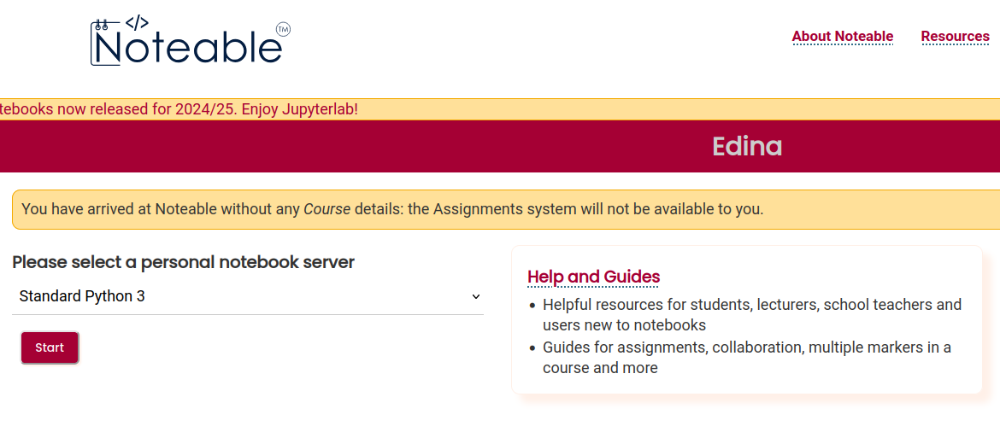
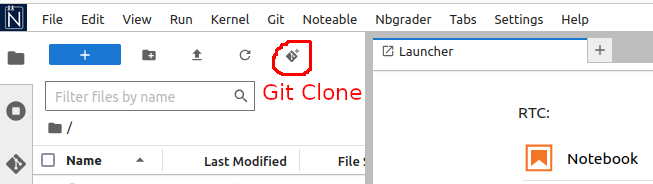
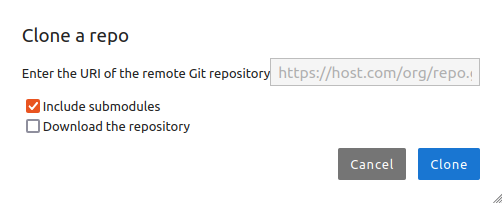
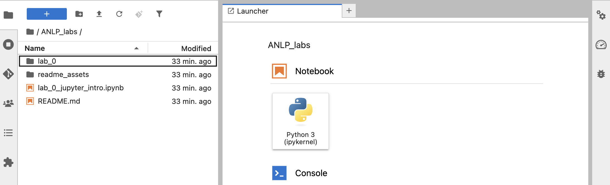
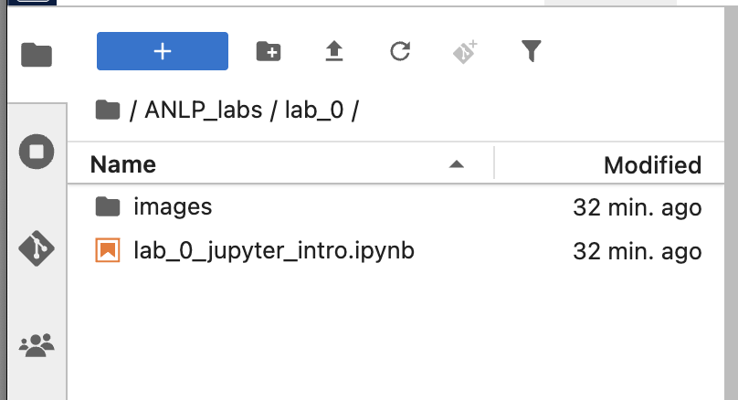

# Labs
#### Accelerated Natural Language Processing (INFR11125)
This repository contains the Jupyter notebooks for the ANLP labs. It also contains instructions for how to get started. We recommend that you use Noteable to do the labs. 

## Gettting Started: Using [Noteable](https://noteable.edina.ac.uk/login)

#### Step 1: 
Go to [https://noteable.edina.ac.uk/login](https://noteable.edina.ac.uk/login). It might ask for your UUN and Password, if you are not logged into Euclid. After login, the following screen will be available with few options to start the server. Or if you have already logged in before it may ask you to reconnect or shutdown the previous server. You can also access it from the Learn course for ANLP

Choose *Language and Machine Learning* and click *Start* or *Reconnect*.

 

#### Step 2: 
The Jupyter Notebook will open in the same window. On the top left click the last icon labelled *Git Clone*.
 

#### Step 3: 
A small pop-up window will appear, as shown below. Enter the following text for the URI field:  
https://git.ecdf.ed.ac.uk/anlp/ANLP_labs.git   
If you get an error here (bottom right), it may be because you already have a folder with the same name in Noteable.  
 

<!-- #### Step 4: 
In the next pop-up window enter your username (i.e. student number with "s") and the corresponding password. Now click *OK* to copy the labs into Noteable.   
**Be careful copying screenshots of any errors you get from this (e.g. into Piazza) as it may display your password in the error message.**
 
 -->

#### Step 4: 
Once the copying is complete, it will show the repository in a folder titled **ANLP_labs** along with its contents on the left.  
 

#### Step 6: 
Each lab is a Jupyter notebook in its own folder. Double click the folder for the lab you want to work on, and then double click on the lab's `.ipynb` (Jupyter notebook) file to start working on it.
 
